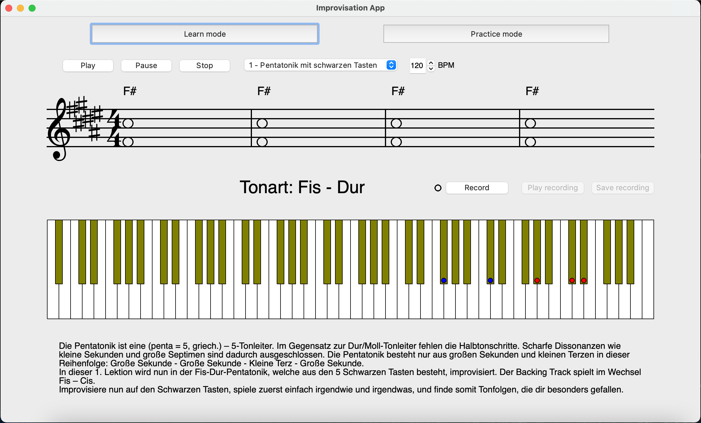
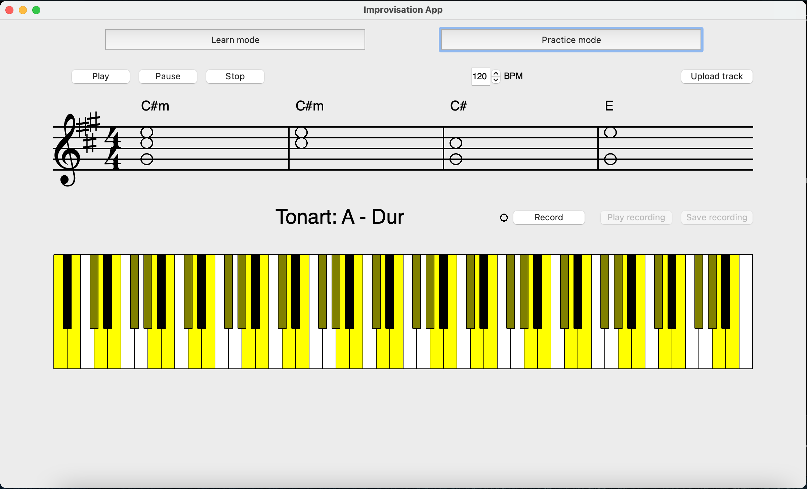

# Improvisation App

Helps Pianists to practice their improvisation skills.

## Description of application:

   
   

The improvisation app is a desktop application created to help pianists learn how to improvise and practice improvisation. It is made for complete improvisation beginners. 
The application provides two modes: The 'Learn mode' (Picture 1) and the 'Practice mode' (Picture 2). In the learn mode you can learn (in so far 7 example-lessons) how to improvise; in the practice mode you can upload any MIDI-File (which so far must contain only full notes) to practice improvisation to it. 
The main focus of this application is to provide guidance and feedback and a backing track. It is to be used on a real piano keyboard, any USB-connected MIDI device can be employed.
 
Guidance is provided through the sections in the learn mode, as well as through analyzing and then showing the tonality of the current MIDI-File Backing Track through a label and by coloring the tonality's keys on the drawn keyboard in yellow. 
Feedback is provided by a recording and export function, as well as the live feedback. The live feedback is shown as little dots on the drawn keyboard when a midi-keyboard is connected.
The backing track is the example file in the practice mode, any uploaded file in the practice mode, or one of the lessons in the learn mode.
The real piano keyboard must be connected to the computer. For this program the midi-keyboard *Nektar Impact GX61* (https://nektartech.com/impact-gx49-61/) was used.

## Setup: 

The program was written in Python (version 3.9.2) in combination with the Package Installer *pip* (version 21.0.1). It was created on a MacBook Pro with the macOS Version Big Sur (11.0.1). 
To start the application, please follow the steps:

1.	Download the code from this GitHub Repository
2.	Install Python 3.9 on your computer
3.	Install pip version 21.0.1 (or later) on your computer
4.	With pip install the libraries used in this project 
    - PyQt5: `pip install PyQt5`
    - fluidsynth: `pip install pyFluidSynth`
    - music21: `pip install music21`
    - mido: `pip install mido`
    - threading: `pip install threading`
    - sys: `pip install sys`
    - time: `pip install time`
    - os: `pip install os`
5.	Connect your midi-keyboard to your computer
6.	You should now be all set and you can run the main file by typing `python main.py` in your terminal. 
7.	You will have to choose the correct connected system to get your piano keyboard in the pop-up, which appears when starting the application.

In the folder 'sound_midis' you can find example files, which you could use for the practice mode. You can either upload them via the "Upload"-Button or set one of them as the default file in constants.py line 52.

`MIDIFILE = ‘sound_midis/CDur_Example.mid’`

In the folder 'theory_midis' you can find the 7 lessons consisting of 14 files: For each lesson a TXT-File and a MIDI-File. They must be named identically, so the program will upload them automatically to the Lessons in the learn mode. You can remove and add files here to adapt the learn mode lessons.

In Lesson 5 the citation is from: https://de.wikipedia.org/wiki/Septakkord  
In Lesson 7 the citation is from: https://www.lernhelfer.de/schuelerlexikon/musik/artikel/kirchentonarten

## Creating a lesson:

To create a lesson you need to create a MIDI-File, e.g. with MuseScore (https://musescore.org/en) which contains the backing track for this lesson and name it for example  
'8 – the pentatonic.mid'.  
Then you create a TXT-File, in which you explain the pentatonic and give some instructions (for a German example see Picture 1). 
You then name the file  
'8 – the pentatonic.txt'.  
Finally, you put both files into the “theory_midis” folder and the system adds the files automatically to the lessons in the learn mode.
